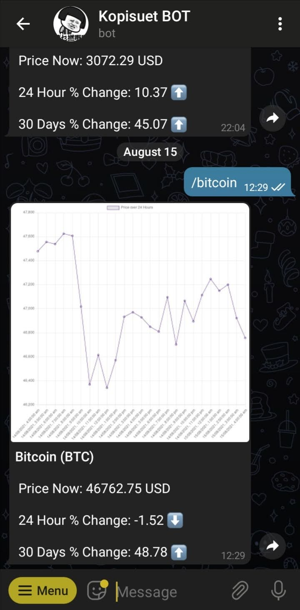

# crypto-telegram-bot

A telegram bot that gives basic information on cryptocurrency details. 

Commands available:
1. `/bitcoin` - Get simple stats of Bitcoin. It includes a graph of Bitcoin price for the past 24 hours. [Example](#Simple-Stats-of-Requested-Coin)

2. `/ethereum` - Get simple stats of Ethereum. It includes a graph of Ethereum price for the past 24 hours. [Example](#Simple-Stats-of-Requested-Coin)

3. `/crypto ${Coin Symbol}` - For example: `/crypto doge`. Get simple stats of requested cryptocurrency coin. It includes a graph of price for the past 24 hours. [Example](#Simple-Stats-of-Requested-Coin)

4. `/cryptonews ${Coin Symbol}` - For example: `/cryptonews BTC`. Get top 5 news of the requested Coin Symbol. [Example](#Top-5-News-of-Requested-Coin) - [Source](https://lunarcrush.com/developers/docs#feeds)

<!-- <b>Examples of Telegram Message </b> -->

### Examples of Telegram Message

#### Simple Stats of Requested Coin

<figcaption><b>Fig.1 - Result of <code>/bitcoin</code>.</b></figcaption>

  

#### Top 5 News of Requested Coin

<figcaption><b>Fig.2 - Result of <code> /cryptonews BTC</code>.</b></figcaption>

---
### Miscellaneous Commands
1. `/joke` - Get a random joke.

2. `/rickandmorty` - Get a random character from Rick and Morty show. 